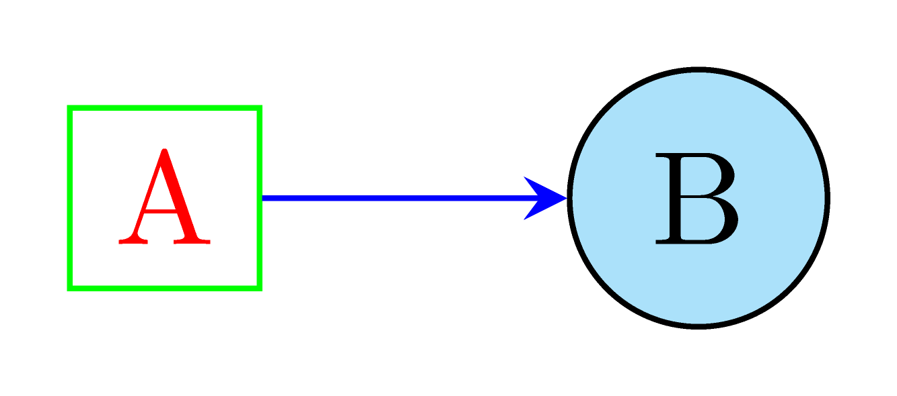

# [LaTeX 绘图指南 - 002] TikZ 基本概念：节点、路径和样式

<b>“20%的功能可以满足80%的需求。”</b>



我们今天以上图作为案例，介绍 TikZ 中的三个基本概念：**节点（node）**，**路径（path）**，**样式（style）**。

生成上图的 LaTeX 代码如下：

（不用着急，我们这篇文章会详细讲解这些代码是怎么来的，有什么作用。）

```TeX
\documentclass[border=5pt, tikz]{standalone}
\usepackage{tikz}
\begin{document}
\begin{tikzpicture}

\node [draw=green, text=red] (a) {A};
\node [draw, shape=circle, fill=cyan!30, anchor=west] (b) at ([xshift=3em]b.east) {B};
\draw [-stealth, blue] (a) -- (b);

\end{tikzpicture}
\end{document}
```

## **初始环境配置**

TeX 文档开头的 `\documentclass[options]{class}` 用于指定文档的类型，不同类型有不同的默认设置。

一般的 LaTeX 写作，使用 `article` 或者 `report` 类型。

然而在绘制图表时，我们主张图片与文本分离，也就是说，在一个单独的文件中绘制图形。

因此我们需要 `standalone` 类型。它的主要效果是去除页边的空白，让人将注意力集中在绘制的图形上。

我们可以用 `border=<length>` 设置页边的空白大小。比如 `border=5pt` 的作用是，在图形边缘留出宽为 5 个像素（pt）的空白。

1 pt 约等于 1/72.27 inch 或 1/2.84 cm。默认情况下，一个大写字母 “M” 的宽度是 10pt（=1em）。


