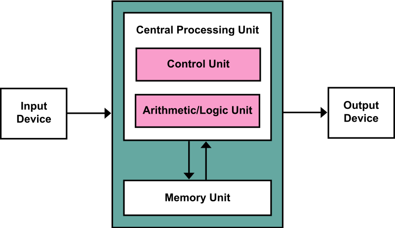
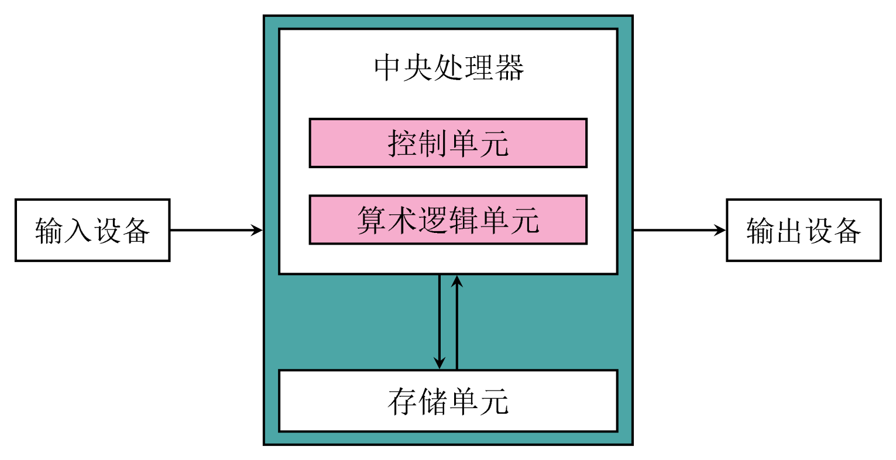

# [LaTeX 绘图案例 - 001] 冯·诺依曼结构示意图

<!-- “一个新的工具应当尽可能照顾初学者。入门时每多花一分钟，工具的使用者就会减少一半。”（摘自 Hansimov 《工具朋克》） -->

<!--  -->

这是 Wiki 词条 [冯·诺依曼结构](https://en.wikipedia.org/wiki/Von_Neumann_architecture) 中的 [示意图](https://en.wikipedia.org/wiki/File:Von_Neumann_Architecture.svg)。（原图为英文，我这里是重新绘制了中文的版本。）

## 后记

**第一个案例我选了很久，既不能太复杂，又要尽可能覆盖常用的方法，还要兼顾不同专业背景的读者。**

比如我一开始是想画一张“如何绘制流程图”的流程图。因为流程图是经常用到的一种表现形式，而且这个流程图本身的内容也是描述“绘制流程图的过程”的（相当于是一个自我指涉）。另外也不用担心不同专业背景的人会不理解图中的术语，毕竟描述画图用到的词语大家都能懂。

然而在设计和绘制这张图的过程中，我发现它的结构并不明朗。如果以它作为案例，读者就会在图的结构和内容上花费过多的时间，从而分散了学习 TikZ 时的注意力，这是本末倒置，因此我就放弃了这个想法。

为什么这个流程图结构不明朗呢？主要原因是我目前对“绘制流程图的流程”的理解还不够深刻，尽管参考查阅了很多流程图绘制方面的知识和案例，但是我暂时还是没能抽象出一个层次分明、逻辑清晰的流程。也许等以后功力长进了，理解更深刻了，就能画好这张图了。

那为什么选择“冯·诺依曼结构示意图”作为第一个案例呢？毕竟读者并不是都是计算机相关专业的，“冯·诺依曼结构”也并不是所有人都知道的。如果图中的专业知识较为冷门的话，那么大部分读者就不能理清图中各个元素的关系，也就不会对它是如何绘制的感兴趣。

这是因为，这样一张图是非常“经典”的结构。这里的“经典”，并不是说冯·诺依曼结构在计算机领域很经典，而是说，**“输入-处理-输出”这样的结构，在各个领域都很常见，也就是说，经典的是这张图的结构。**理解这张图，就能画好其他类似的图。

更何况，我默认大部分想要了解 TikZ 的人，事先已经对 LaTeX 有一定的了解，具备相关的软件基础，也就不会对计算机领域的专业知识一无所知。

那又为什么不直接画一张简单的图，只含“输入、处理、输出”这三个节点呢？这样不是更加简洁、更能突出重点吗？读者不是学起来更容易吗？

这出于几个方面的考虑。

**一是要在“抽象”和“具体”之间作一个折中。**图的内容太抽象，则不便理解（反之，图的内容太具体，则会让人忽视图的形式）。

**二是要选择一个合适的绘图难度**。如果太简单，那么人们就没有动力（反之，如果太困难，那么人们就缺乏信心）。

**三是要平衡好知识点的密度。**如果知识点太少，那么学完之后依旧啥都做不了（反之，如果知识点太多，那么就没有重点）。

在上述各点中，括号之前的部分，就是在解释为什么不画一张过于简单的图。

尽管如此，我对第一个案例的选题依旧不满意，因为无论如何，它对非计算机相关专业的读者都是不够友好的。

期待能在评论区得到各位的反馈。

